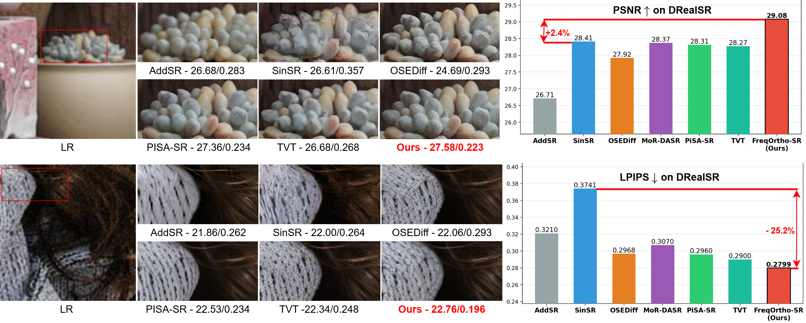
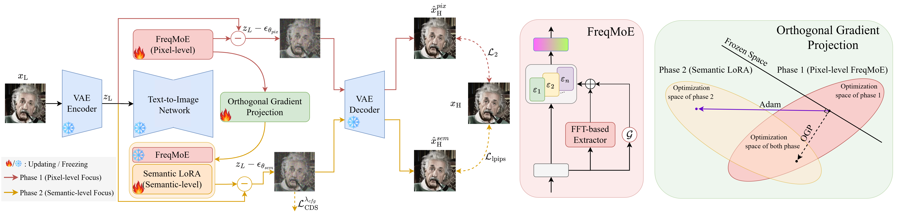
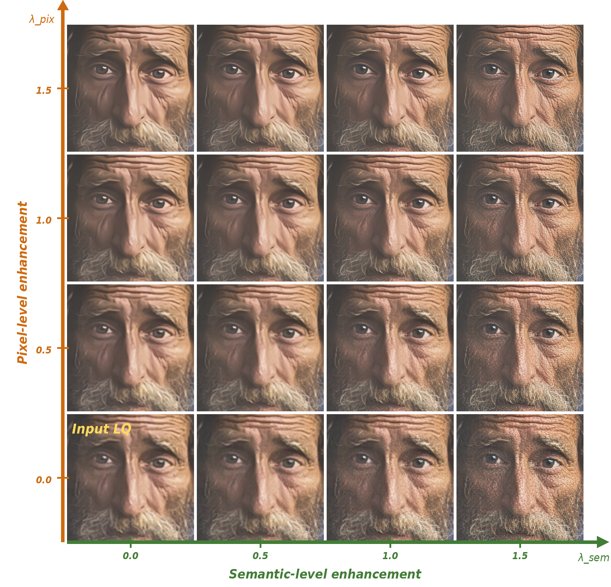
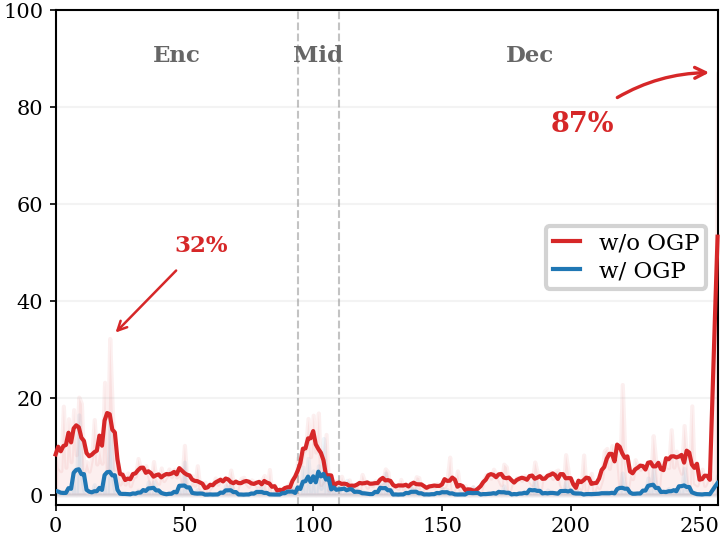

<div align="center">
<h2>FreqOrtho-SR: Frequency-Guided Orthogonal Expert Learning for Real-World Image Super-Resolution</h2>

<b>Accepted to ECCV 2026</b>

<br>

[Minh Son Hoang](mailto:sonhm2910@kaist.ac.kr)<sup>&#42;</sup>,
[Dinh Phu Tran](mailto:phutx2000@kaist.ac.kr)<sup>&#42;</sup>,
[Quyen Nguyen Duc](mailto:nguyenducquyen2311@kaist.ac.kr),
[Dam Hoang Phuong](mailto:hoangphuong1211@kaist.ac.kr),
[Daeyoung Kim](mailto:kimd@kaist.ac.kr)<sup>&#8224;</sup>

School of Computing, KAIST, Republic of Korea

<sup>&#42;</sup> Equal contribution. <sup>&#8224;</sup> Corresponding author.

<br>

[](#)
[](https://github.com/sonhm3029/FreqOrtho-SR)
[](LICENSE)

</div>

## Updates

- **2026.06.26**: Initial code release for FreqOrtho-SR. Paper, pretrained checkpoints, and project links will be added once they are public.

## Overview

FreqOrtho-SR is a one-step diffusion framework for real-world image super-resolution. It builds on the dual-LoRA paradigm of PiSA-SR and introduces two components:

- **Frequency-guided Mixture of LoRA Experts (FreqMoE)**: routes low-quality inputs to specialized pixel-level LoRA experts using lightweight FFT-based degradation features.
- **Orthogonal Gradient Projection (OGP)**: extracts the pixel-fidelity LoRA subspace with SVD and projects semantic LoRA gradients onto its null space, reducing interference between fidelity and perceptual objectives.

<p align="center">
  
</p>

## Framework

<p align="center">
  
</p>

FreqOrtho-SR trains in two phases:

1. **Pixel phase**: train FreqMoE with an L2 objective and optional load-balancing loss for degradation-adaptive restoration.
2. **Semantic phase**: freeze the pixel FreqMoE, extract its SVD subspace, and train the semantic LoRA with OGP under L2, LPIPS, and CSD losses.

At inference time, the default mode uses a single forward pass. The adjustable mode uses separate pixel and semantic guidance scales, `lambda_pix` and `lambda_sem`, to control the fidelity-perception trade-off.

## Visual Results

<p align="center">
  
</p>

### Adjustable Super-Resolution

<p align="center">
  
</p>

Increasing `lambda_pix` strengthens pixel-level restoration and degradation removal. Increasing `lambda_sem` adds semantic and perceptual details, but very large values may introduce artifacts.

## Quantitative Results

The following numbers are reported in the ECCV 2026 paper for one-step diffusion-based SR comparisons.

| Dataset | PSNR (higher) | SSIM (higher) | LPIPS (lower) | DISTS (lower) | FID (lower) | NIQE (lower) | MANIQA (higher) |
| --- | ---: | ---: | ---: | ---: | ---: | ---: | ---: |
| RealSR | 26.27 | 0.7481 | 0.2537 | 0.1951 | 108.91 | 5.32 | 0.6586 |
| DRealSR | 29.08 | 0.7911 | 0.2799 | 0.2110 | 130.85 | 6.29 | 0.6182 |
| DIV2K | 24.35 | 0.6189 | 0.2748 | 0.1889 | 23.54 | 4.63 | 0.6355 |

### Subspace Orthogonality

<p align="center">
  
</p>

OGP suppresses semantic LoRA overlap with the pixel-level subspace, encouraging semantic updates to use independent capacity rather than relearning fidelity-oriented directions.

## Installation

```bash
git clone https://github.com/sonhm3029/FreqOrtho-SR
cd FreqOrtho-SR

conda create -n freqortho-sr python=3.10
conda activate freqortho-sr
pip install --upgrade pip
pip install -r requirements.txt
```

Alternatively, use the provided Conda environment file:

```bash
conda env create -f environment.yaml
conda activate PiSA-SR
```

This repository uses a local `vendor/peft` implementation for mixture-of-LoRA-experts routing. Keep the `vendor` directory in place when training or testing FreqMoE checkpoints.

## Prepare Models

Create the model folders:

```bash
mkdir -p preset/models
mkdir -p src/ram_pretrain_model
```

Download the required pretrained models:

- Stable Diffusion 2.1-base from [Hugging Face](https://huggingface.co/stabilityai/stable-diffusion-2-1-base), saved for example under `preset/models/SD21`.
- RAM checkpoint `ram_swin_large_14m.pth` from [Recognize Anything](https://huggingface.co/spaces/xinyu1205/recognize-anything/blob/main/ram_swin_large_14m.pth), saved to `src/ram_pretrain_model/ram_swin_large_14m.pth`.
- FreqOrtho-SR checkpoint, saved for example as `preset/models/freqortho_sr.pkl`. If the pretrained checkpoint is not yet public, use a locally trained checkpoint from `experiments/.../checkpoints/model_*.pkl`.

## Quick Inference

Put input images in `preset/test_datasets` or pass a single image path with `--input_image`.

### Default one-step mode

```bash
python test_pisasr.py \
  --pretrained_model_path preset/models/SD21 \
  --pretrained_path preset/models/freqortho_sr.pkl \
  --process_size 512 \
  --upscale 4 \
  --input_image preset/test_datasets \
  --output_dir experiments/test \
  --default
```

### Adjustable mode

```bash
python test_pisasr.py \
  --pretrained_model_path preset/models/SD21 \
  --pretrained_path preset/models/freqortho_sr.pkl \
  --process_size 512 \
  --upscale 4 \
  --input_image preset/test_datasets \
  --output_dir experiments/test_adjustable \
  --lambda_pix 1.0 \
  --lambda_sem 1.0
```

### Memory-saving tiled inference

`test_pisasr.py` supports tiled latent diffusion and tiled VAE decoding for large images:

```bash
python test_pisasr.py \
  --pretrained_model_path preset/models/SD21 \
  --pretrained_path preset/models/freqortho_sr.pkl \
  --process_size 512 \
  --upscale 4 \
  --input_image preset/test_datasets \
  --output_dir experiments/test_tiled \
  --latent_tiled_size 96 \
  --latent_tiled_overlap 32 \
  --vae_encoder_tiled_size 1024 \
  --vae_decoder_tiled_size 224 \
  --default
```

You can also edit and run:

```bash
bash scripts/test/test_default.sh
```

## Training

### Prepare training data

Generate text files that list high-quality ground-truth image paths:

```bash
python scripts/get_path.py
```

By default, `scripts/get_path.py` writes `preset/gt_path.txt`. Edit `folder_path` and `txt_path` in that script for your dataset. For the high-quality subset used in semantic training, create `preset/gt_selected_path.txt` with the same one-path-per-line format.

The validation folder should follow this structure:

```text
preset/testfolder/
  test_SR_bicubic/
  test_HR/
```

The RealESRGAN degradation configuration is stored at `src/datasets/params.yml`. Because the dataset loader resolves the path relative to `src/datasets`, pass it as `--deg_file_path=params.yml`.

### Train FreqOrtho-SR

The recommended script trains FreqMoE first, extracts the pixel LoRA SVD subspace, and then trains semantic LoRA with OGP:

```bash
bash scripts/train/train_pisasr_mole_freq_ortho.sh
```

The script is configured with:

- `num_experts_pix=4`
- `top_k_pix=2`
- `use_freq_gate`
- `freq_dim=7`
- `ortho_enabled`
- `svd_energy_threshold=0.95`
- `pix_steps=4000`

Core training command:

```bash
CUDA_VISIBLE_DEVICES=0,1,2,3 accelerate launch --config_file config.yml train_pisasr.py \
  --pretrained_model_path="preset/models/SD21" \
  --pretrained_model_path_csd="preset/models/SD21" \
  --dataset_txt_paths="preset/gt_path.txt" \
  --highquality_dataset_txt_paths="preset/gt_selected_path.txt" \
  --dataset_test_folder="preset/testfolder" \
  --learning_rate=5e-5 \
  --train_batch_size=4 \
  --prob=0.1 \
  --gradient_accumulation_steps=1 \
  --enable_xformers_memory_efficient_attention \
  --checkpointing_steps 500 \
  --seed 123 \
  --output_dir="experiments/mole-freq-ortho" \
  --cfg_csd 7.5 \
  --timesteps1 1 \
  --lambda_lpips=2.0 \
  --lambda_l2=1.0 \
  --lambda_csd=1.0 \
  --pix_steps=4000 \
  --lora_rank_unet_pix=4 \
  --lora_rank_unet_sem=4 \
  --min_dm_step_ratio=0.02 \
  --max_dm_step_ratio=0.5 \
  --null_text_ratio=0.5 \
  --align_method="adain" \
  --deg_file_path="params.yml" \
  --tracker_project_name "FreqOrthoSR" \
  --is_module True \
  --num_experts_pix=4 \
  --top_k_pix=2 \
  --num_shared_experts_pix=0 \
  --use_load_balance_loss \
  --lambda_load_balance=0.01 \
  --use_freq_gate \
  --freq_dim=7 \
  --ortho_enabled \
  --svd_energy_threshold=0.95 \
  --save_svd_subspaces
```

Checkpoints are saved under `experiments/.../checkpoints/` as:

- `model_*.pkl`: model weights for inference.
- `training_state_*.pt`: optimizer, scheduler, step, and phase state for resume.
- `pixel_lora_subspaces.pt`: saved SVD bases for OGP resume when `--ortho_enabled` is used.

## Evaluation

Run inference first, then compute metrics against ground truth:

```bash
python test_metrics.py \
  --inp_imgs experiments/test \
  --gt_imgs preset/testfolder/test_HR \
  --log experiments/logs
```

For batch evaluation, edit dataset paths in `scripts/test/eval_metrics.sh` and run:

```bash
bash scripts/test/eval_metrics.sh
```

The metric script reports PSNR, SSIM, LPIPS, DISTS, FID, CLIPIQA, NIQE, MUSIQ, and MANIQA.

## Repository Structure

```text
pisasr.py                              # FreqOrtho-SR model and inference wrapper
train_pisasr.py                        # two-phase training with FreqMoE and OGP
test_pisasr.py                         # inference entry point
test_metrics.py                        # image quality evaluation
src/models/degradation_features.py     # FFT-based degradation feature extractor
src/ortho_utils/                       # SVD extraction and gradient projection hooks
vendor/peft/                           # local PEFT extension for mixture LoRA experts
scripts/train/train_pisasr_mole_freq_ortho.sh
scripts/test/test_default.sh
scripts/test/eval_metrics.sh
```

## Citation

If this repository helps your research, please cite our paper:

```bibtex
@inproceedings{hoang2026freqorthosr,
  title={{FreqOrtho-SR}: Frequency-Guided Orthogonal Expert Learning for Real-World Image Super-Resolution},
  author={{Minh Son Hoang} and {Dinh Phu Tran} and {Quyen Nguyen Duc} and {Dam Hoang Phuong} and {Daeyoung Kim}},
  booktitle={Proceedings of the European Conference on Computer Vision},
  year={2026}
}
```

## License

This project is released under the [Apache 2.0 license](LICENSE).

## Acknowledgement

This project is based on [PiSA-SR](https://github.com/csslc/PiSA-SR) and [OSEDiff](https://github.com/cswry/OSEDiff). We thank the authors for their excellent open-source work.
